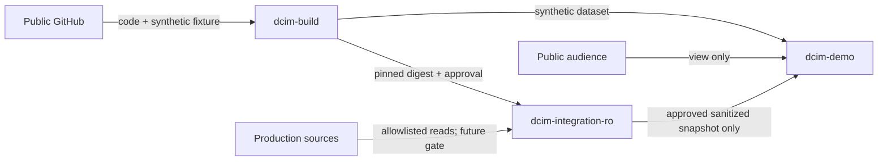
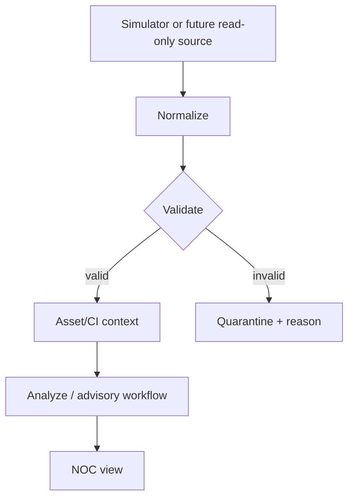

# Runtime Plane Separation

Phase 0 hanya design. Tidak ada Docker network, firewall rule, credential, atau deployment aktif.

## Plane

### `dcim-build` (`DEV-BUILD / SIMULATION`)

Synthetic data only, mutable source mount diperbolehkan, unit/integration/build image, dan tidak memiliki route ke Production.

### `dcim-integration-ro` (`DEV-INTEGRATION-RO`)

Pinned image digest only, no source bind mount, dedicated read-only identity, separate private credential/network/volume, endpoint+method allowlist, bounded polling, short retention, audit, dan emergency kill switch. Manual promotion wajib; Phase 0 tetap disabled.

### `dcim-demo` (`DEV-DEMO`)

Synthetic atau explicitly approved sanitized snapshot, tanpa Production route/credential. Screenshot hanya dibuat di plane ini setelah public-safety review.

## Trust dan data flow

## Credential dan network boundary

`dcim-build` dan `dcim-demo` tidak memiliki Production credential atau route. `dcim-integration-ro` memakai secret store reference private, separate identity, separate egress allowlist, dan no shared volume/env file. Credential tidak ikut image, Git, evidence, log, atau Hermes context.

## Promotion dan rollback

Build dari reviewed commit, scan/test, record digest, owner approval, lalu manual promote digest ke isolated plane. Rollback menghentikan collector, mencabut egress bila perlu, dan kembali ke prior pinned digest; tidak menyalin runtime volume antar-plane.

## Failure modes dan stop conditions

Stop pada privilege write, missing/expired authorization, unpinned artifact, unexpected endpoint/egress, polling impact, audit loss, kill switch failure, data leakage, cross-plane volume reuse, atau route Production pada build/demo. Jangan melanjutkan bila remediation membutuhkan Production access pada agent/CI.

## Future Staging mapping

Staging memiliki build provenance, integration, dan demo/UAT boundary terpisah dengan named Platform/SRE, Data/Integration, Security, QA/UAT, dan domain owner. Mapping memerlukan environment-specific authorization; Development approval tidak otomatis berlaku.
