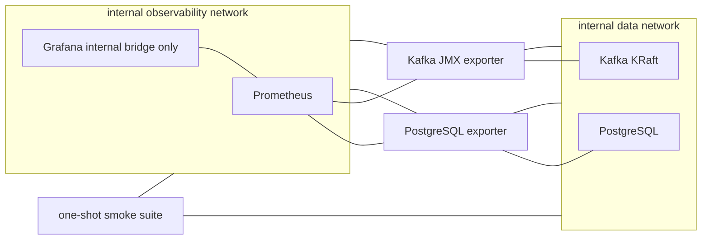

# Phase 1 Compact Infrastructure Foundation

Date: 2026-07-20  
Status: Owner-approved design; Development implementation qualified locally  
Owner: `shuffahaqgzz`

## 1. Purpose

Phase 1 will prove that the minimum stateful and observability foundation can be
started, health-checked, functionally smoke-tested, stopped, recovered, and
rebuilt on the Development VM. It advances the Compose foundation and stateful
core work from Days 2 and 3 of `DEV-BOOTSTRAP-V0.1.md`.

This design is limited to synthetic `DEV-BUILD / SIMULATION`. It does not
activate a Production connector, Hermes, workflow execution, or any write or
control path.

## 2. Authority and assumptions

This design follows:

1. `docs/baseline/DEVELOPMENT-BASELINE.md`;
2. accepted ADR-0001, ADR-0002, ADR-0003, ADR-0004, and ADR-0008;
3. `docs/plan/DEV-BOOTSTRAP-V0.1.md`;
4. owner decisions recorded during the Phase 1 design grill on 2026-07-20.

Assumptions:

- target host is Ubuntu Server 24.04, `linux/amd64`, with 32 vCPU, 64 GiB RAM,
  and a 500 GiB SSD;
- Docker Engine and the Compose plugin are installed before foundation startup;
- all test data is synthetic and public-safe;
- exact upstream image versions and digests require a separately approved
  network-enabled verification step before implementation;
- Kubernetes parity, HA, SLA, and Production hardening remain out of scope.

## 3. Canonical boundaries

A **Runtime Plane** is a security and data boundary. A **Capability Profile** is
only a selectable service group inside one Runtime Plane. A Compose profile must
never be treated as plane isolation.

Only `dcim-build` is executable in Phase 1:

| Runtime Plane | Phase 1 state | Data boundary |
|---|---|---|
| `dcim-build` | Executable | Synthetic only; no office or Production route |
| `dcim-integration-ro` | Contract and README only | No runnable Compose manifest, credential, connector, or route |
| `dcim-demo` | Contract and README only | No runnable Compose manifest; C-05 remains open |

Each future plane must have a separate directory, Compose project, network,
volume, runtime configuration, credential set, and promotion lifecycle. No env
file, volume, or override may be shared across planes.

## 4. Runtime shape

Phase 1 contains only:

- PostgreSQL;
- one Kafka broker/controller in combined KRaft mode;
- Prometheus;
- Grafana;
- PostgreSQL and Kafka metrics exporters;
- one-shot synthetic smoke clients orchestrated from the host.

Redis and all application services are deferred until a concrete consumer
justifies them.



### Capability Profiles

Every service must belong to an explicit profile. Running `docker compose up`
without `--profile` must start nothing.

| Profile | Contents |
|---|---|
| `data` | PostgreSQL and Kafka KRaft |
| `observability` | Prometheus, Grafana, and metrics exporters |
| `smoke` | One-shot smoke clients, when required |

Future names remain reserved: `core`, `dashboard`, `workflow`,
`connectors-synthetic`, `connectors-integration-ro`, and `hermes`. A Make target
will activate the three Phase 1 profiles explicitly.

## 5. Network and access policy

- `data` and `observability` are separate Compose networks with `internal: true`.
- The smoke suite is dual-homed only while a bounded test is running.
- PostgreSQL and Kafka metrics exporters are the only long-running dual-homed
  exceptions. They must set `net.ipv4.ip_forward=0`, drop all capabilities, and
  expose only their metrics endpoints.
- No long-running general-purpose proxy bridges the networks.
- PostgreSQL, Kafka, Prometheus, and Grafana publish no host ports.
- Grafana access follows ADR-0012: resolve its current internal bridge address
  through the bounded Development helper. No loopback proxy is introduced.
- Grafana uses local generated credentials; anonymous access and signup are
  disabled. HTTP is accepted only on the isolated internal bridge with no
  published host route.
- Kafka uses `PLAINTEXT` only on the internal synthetic `data` network. It has no
  published listener, automatic topic creation, or Production security claim.
  Broker and topic message size are bounded to 1 MiB. The only Phase 1 topic is
  the explicitly provisioned non-internal topic `dcim.synthetic.smoke.v1`;
  smoke must fail if another non-internal topic exists. Kafka-managed internal
  topics required by the pinned broker are permitted and reported separately.
- A change to route, bind address, Runtime Plane, or data classification requires
  security revalidation.

## 6. State, configuration, and secrets

Persistent named volumes are limited to PostgreSQL, Kafka, and Prometheus.
Grafana is rebuilt from versioned datasource and dashboard provisioning and uses
disposable runtime state.

Rules:

- one named volume per stateful service;
- no shared volume across services or Runtime Planes;
- no bind-mounted mutable state;
- repository configuration mounts are read-only;
- logs go only to stdout and stderr;
- `compose down` preserves volumes;
- data reset is a separate, explicitly confirmed operation scoped to named
  `dcim-build` volumes.

The existing external runtime root remains authoritative. A future
`make foundation-bootstrap` will generate `dev-build`-only PostgreSQL, Grafana,
and Kafka bootstrap material outside the repository with file mode `0600`. It
must refuse to overwrite existing material. It must not create credentials for
`dcim-integration-ro` or `dcim-demo`.

Secrets must enter containers through Compose secret files or an image-supported
`_FILE` mechanism. Literal environment values, command-line secrets, and secret
interpolation into normalized Compose output are prohibited. Policy and evidence
commands must redact sensitive values and must not persist full Compose output.

PostgreSQL monitoring and smoke operations use separate least-privilege roles.
The bootstrap superuser is not used by routine smoke checks. Kafka JMX metrics
are read-only and internal.

## 7. Image and supply-chain policy

Each third-party runtime image must use readable immutable notation:

```text
upstream/image:exact-version@sha256:digest
```

Floating tags, major-only tags, and automatic digest refresh are prohibited.
Images must come from official upstream projects: PostgreSQL, Apache Kafka,
Prometheus, Grafana, and relevant upstream Prometheus exporters. Convenience
forks and bundled vendor distributions are excluded.

Accepted ADR-0013 permits a narrow Development-only exception when a selected
official image fails the vulnerability gate: the project may reproducibly build
a clearly identified derived hardened image from exact upstream release inputs.
ADR-0014 accepts immutable official PostgreSQL and Kafka release binaries plus
checksum-verified source provenance; Grafana OSS and PostgreSQL exporter remain
full source builds. Each derivative must preserve the service version and every
runtime contract, use immutable build inputs, carry only evidence-backed
security remediation, and pass the unchanged vulnerability and lifecycle gates.
It may not be published to a public or shared registry while OD-06 or applicable
upstream redistribution/source obligations remain unresolved. A clean official
upstream image remains the preferred replacement.

A versioned inventory must record image, exact version, digest, upstream source,
architecture, license, and verification date. Each digest change is reviewed
separately and reruns all foundation smoke tests.

Every image must produce an SBOM, license inventory, and vulnerability report:

- any Critical finding is NO-GO;
- a High finding with a fix is NO-GO;
- a High finding without a fix requires owner disposition and expiry;
- unknown, restricted, or strong-copyleft license findings require review while
  repository license decision OD-06 remains open;
- GitHub Actions are pinned to full commit SHAs;
- scanner containers are pinned to immutable image digests;
- scanner/action versions and vulnerability database timestamps are evidence.

## 8. Container hardening

Default controls for every service:

- non-root user;
- `cap_drop: [ALL]`;
- `no-new-privileges`;
- read-only root filesystem;
- writable paths limited to the service named volume or `tmpfs`;
- no privileged mode, host network/PID/IPC, device mapping, Docker socket, or
  added Linux capability;
- bounded `restart: on-failure:3` for long-running services;
- no restart policy for one-shot smoke clients;
- Docker `json-file` logging with `max-size: 10m` and `max-file: 3`.

An upstream-image incompatibility may create a narrow exception only when a test
demonstrates it. The exception must be documented per service and enforced by a
policy test. Extra privilege is not an acceptable permission workaround.

## 9. Resource and storage envelope

The aggregate hard ceiling is 10 vCPU and 18 GiB RAM:

| Component | CPU limit | Memory limit |
|---|---:|---:|
| PostgreSQL | 2 | 4 GiB |
| Kafka | 3 | 6 GiB |
| Prometheus | 2 | 4 GiB |
| Grafana | 1 | 1 GiB |
| Exporters, aggregate | 1 | 1 GiB |
| One-shot smoke suite | 1 | 2 GiB |

The aggregate operational disk budget is 100 GiB:

- Kafka: 40 GiB budget, 24-hour retention, 256 MiB segments;
- Prometheus: 20 GiB or seven days, whichever is reached first;
- PostgreSQL: 20 GiB planning budget with no automatic data deletion;
- images, temporary data, and margin: 20 GiB.

Prometheus alerts evaluate logical service usage at 70%, 85%, and 90% of these
budgets. A local preflight check measures host capacity. Phase 1 deliberately
does not deploy continuous host-level telemetry because that would require broad
host mounts, host namespaces, or Docker socket access.

At 90% logical usage, smoke must refuse new writes and fail with an explicit
capacity disposition. No ingestion service exists in Phase 1; a later ingestion
implementation must stop admission at the same threshold unless a newer owner
decision changes the policy.

Resource or timeout increases require evidence from the target Development VM;
they are not automatic responses to test failure.

## 10. Health and observability contracts

Container health means a service can accept a basic local operation. It is not
functional acceptance evidence.

| Service | Health contract |
|---|---|
| PostgreSQL | Local readiness check |
| Kafka | Broker metadata and controller readiness, not a TCP-only probe |
| Prometheus | `/-/ready` |
| Grafana | `/api/health` |
| PostgreSQL exporter | Local metrics endpoint succeeds; functional smoke requires Prometheus `up=1` and exporter `pg_up=1` |
| Kafka JMX exporter | Local metrics endpoint succeeds; functional smoke requires Prometheus `up=1` and expected broker/controller metrics with valid values |

All health checks have explicit interval, timeout, retry count, and startup grace.
The whole foundation must become healthy within 180 seconds.

Prometheus scrapes only PostgreSQL exporter metrics, Kafka JMX metrics, and
Prometheus/Grafana self-metrics. There is no cAdvisor, Docker socket, privileged
collector, host PID/network access, broad host filesystem mount, Alertmanager,
notification delivery, or external telemetry.

Initial rules cover service availability, scrape failure, Kafka logical storage
and consumer lag, PostgreSQL logical size and connection pressure, and Prometheus
retention usage. Grafana displays health and capacity. Synthetic smoke verifies
that targets and rules load and that a controlled alert can change state.

## 11. Synthetic smoke and recovery

The smoke suite is a Python standard-library host orchestrator. It uses CLI tools
already present in the pinned PostgreSQL, Kafka, and Prometheus images. No extra
runner image or package is introduced. Every run has a synthetic run ID, bounded
timeouts, cleanup, and machine-readable JSON evidence.

### `smoke-fast`

The PR suite must:

1. normalize and validate the Compose model;
2. start the selected profiles and reach health within 180 seconds;
3. write and read a synthetic PostgreSQL record using the smoke role;
4. verify the exact non-internal Kafka topic allowlist and 1 MiB limit, report
   broker-managed internal topics separately, then produce and consume one
   validated synthetic event through `dcim.synthetic.smoke.v1` and verify its
   run ID;
5. confirm Prometheus targets, rules, and controlled alert behavior;
6. confirm Grafana health and datasource provisioning;
7. finish within five minutes.

### `smoke-recovery`

The preflight suite must restart services, prove PostgreSQL and Kafka synthetic
state persists, confirm observability recovers, and finish within 15 minutes.

It also performs a synthetic PostgreSQL `pg_dump`, restores into a disposable
database, and verifies row count and logical checksum. Dumps remain outside Git
and are removed after success unless evidence retention is explicitly requested.
Kafka evidence covers restart and replay only; it is not a Kafka backup claim.

Stopping all containers must complete within 60 seconds. Timeouts are failures;
the suite does not wait or retry without bound. All timestamps use UTC.

## 12. Lifecycle and stop controls

The Make interface will distinguish:

- `foundation-bootstrap`: create missing protected `dev-build` runtime material;
- `foundation-up`: start the three explicit Phase 1 profiles;
- `foundation-stop`: stop containers and retain volumes;
- `foundation-down`: remove containers and networks and retain volumes;
- `foundation-reset`: remove only resolved `dcim-build` volumes after interactive
  confirmation; unavailable in CI;
- `foundation-smoke`: run `smoke-fast`;
- `foundation-recovery`: run restart and dump/restore checks.

No command may operate on the `dcim-integration-ro` or `dcim-demo` runtime roots.
Emergency stop behavior is a bounded smoke assertion.

## 13. Policy-as-code gates

PR checks inspect normalized `docker compose config`, not only source YAML. They
fail closed on:

- any image without a digest;
- any service without an explicit Capability Profile;
- privileged mode, host namespace, device, Docker socket, added capability, or
  broad host mount;
- any published endpoint;
- a non-internal network;
- shared or cross-plane volumes and bind-mounted mutable state;
- missing health checks, resource limits, or log rotation;
- connector, Hermes, workflow, or write/control services;
- literal/command-line/environment secrets, secret interpolation, or unresolved
  placeholders;
- Kafka automatic topic creation, unexpected non-internal topics, or message
  limits above 1 MiB;
- any dual-homed long-running service except the two named metrics exporters, or
  either exporter without `net.ipv4.ip_forward=0`;
- an exporter image/command not matching the reviewed inventory, or any exporter
  configured as an application-layer proxy.

Compose remains explicit YAML with limited `x-*` anchors. No Jinja, Helm,
`envsubst`, or manifest generator is introduced. The normalized Compose result
is the canonical policy input.

## 14. CI and evidence

Pull requests run policy checks and `smoke-fast` on a GitHub-hosted
`ubuntu-24.04` runner using synthetic fixtures only. A self-hosted or
Production-connected runner is prohibited.

Implementation must extend local `make preflight` with `smoke-recovery` and
PostgreSQL dump/restore. A milestone claim additionally requires a clean rebuild
from an empty external runtime directory: bootstrap, digest-pinned pull, start,
fast smoke, recovery, restore, and stop.

Raw evidence is stored under the protected external runtime root. It may record
commit, image digest, Capability Profile, UTC time, duration, assertion result,
and synthetic run ID. It must not record environment dumps, credentials, full
container inspection, hostnames, or host paths. CI may retain the JSON as an
artifact. Git receives only an explicitly promoted, manually reviewed,
public-safety-scanned summary.

## 15. Acceptance criteria

Phase 1 design implementation is acceptable only when:

- `dcim-build` starts no service without explicit profiles;
- all required services start within the resource and timing envelope;
- health, observability, policy, fast smoke, recovery, and dump/restore tests pass;
- only Grafana is reachable from host loopback;
- image provenance, digest, SBOM, license, and vulnerability evidence exists;
- runtime secrets and raw evidence remain outside Git;
- clean-machine rebuild passes on Ubuntu 24.04;
- `make preflight` passes;
- limitations and public-safe evidence are recorded.

This work advances C-03 structural separation and C-07 resource/retention
evidence. It does not close either condition by design alone. C-05 remains open
because `dcim-demo` is non-executable. C-01, C-04, C-08, and C-09 are not entered
because no connected connector or Hermes path exists. Only the owner may change
condition status.

## 16. Explicit non-claims

Phase 1 does not prove:

- a P1 or P2 vertical slice;
- normalize, validate, DLQ/quarantine, enrichment, Asset/CI, analytics, workflow,
  SIEM/SOAR, or NOC application behavior;
- completeness, event-to-dashboard latency, or zero silent loss under workload;
- Kafka backup, HA, durability, scalability, SLA, Staging readiness, or
  Production readiness;
- continuous host-level telemetry;
- any office or Production source access.

Development implementation now exists under `deploy/compose/dev-build` and is
qualified by the repository gates. Issue review/merge, OD-06, official-image
replacement, and every Staging/Production condition remain separate.
