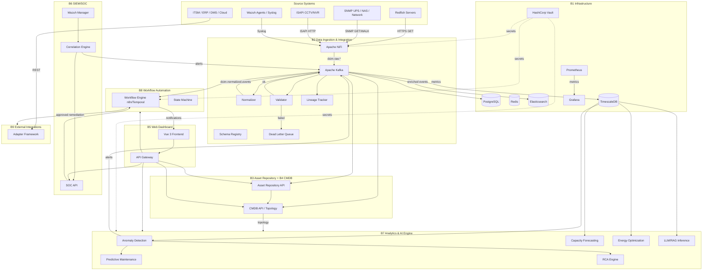
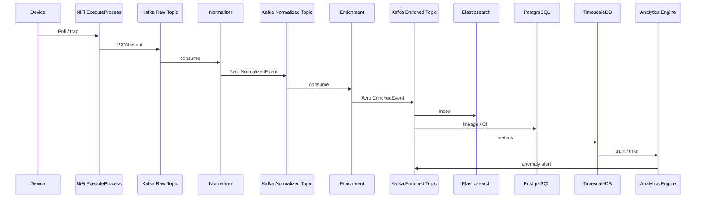
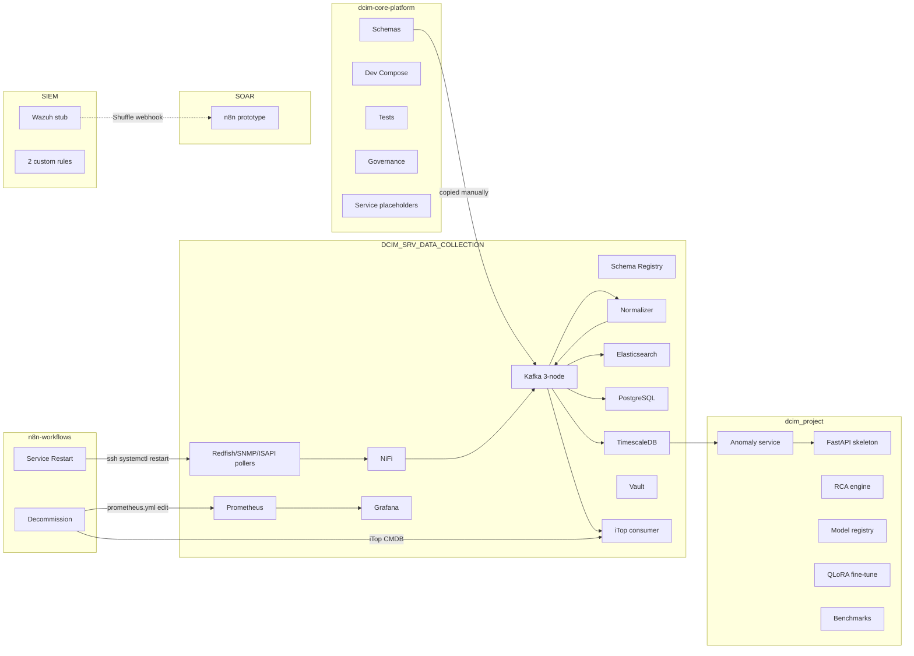
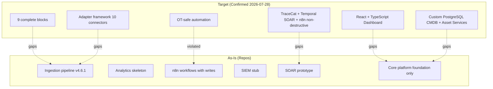
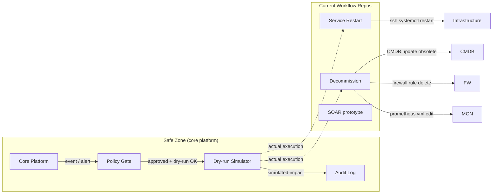

# Architecture — DCIM Core Platform Program

**Tanggal:** 2026-07-28  
**Scope:** Arsitektur target (sesuai `dcim-wiki` B1–B9) vs arsitektur aktual (dari 6 repo implementasi).  
**Notasi:** Diagram Mermaid (text-based) untuk version control dan review.

---

## 1. Target Architecture (Reference Design B1–B9)

### 1.1 Logical Blocks

| Block | Nama | Fungsi utama | Teknologi target |
|---|---|---|---|
| B1 | Infrastructure Provisioning | Foundation runtime: DB, cache, message bus, data flow, search, monitoring, secret management | PostgreSQL 16, Redis 7, Kafka 3.x KRaft, NiFi 1.x, Elasticsearch 8.x, Prometheus, Grafana, Vault, Docker Compose/K8s |
| B2 | Data Ingestion & Integration | Gateway semua data masuk: protocol adapters, normalizer, validator, DLQ, lineage | NiFi, Kafka, Schema Registry, Avro |
| B3 | Asset Repository | SSOT aset fisik, finansial, kontrak | PostgreSQL, CRUD API, Redis cache, bulk import |
| B4 | CMDB | SSOT Configuration Items, relationships, topology, impact | PostgreSQL, topology engine, reconciliation |
| B5 | Web Dashboard | NOC/SOC/Facilities/CMDB/SLA/Logs/Tasks views | Vue 3, Pinia, ECharts, Tailwind, WebSocket |
| B6 | SIEM/SOC | Security event ingestion, correlation, incident response, compliance | Wazuh, Elasticsearch, correlation engine, SOC API |
| B7 | Analytics & AI Engine | Time-series, anomaly detection, predictive maintenance, RCA, capacity, energy, LLM/RAG | TimescaleDB, scikit-learn, Prophet, LSTM, Ollama/llama.cpp, QLoRA |
| B8 | Workflow Automation | State machine, approval, runbook, remediation, escalation | n8n, Temporal |
| B9 | External Integrations | Adapter framework: ITSM, ERP, DMS, NMS, cloud | ServiceNow, Jira, SAP, Oracle, AWS, GCP, Azure |

### 1.2 Target Component Diagram



### 1.3 Target Data Flow (Telemetry Path)



### 1.4 Target Event Topics

| Topic | Format | Producer | Consumers | Purpose |
|---|---|---|---|---|
| `dcim.raw.*` | JSON | NiFi / pollers | Normalizer | Raw telemetry |
| `dcim.normalized.events` | Avro | Normalizer | ES consumer, SQL consumer, enrichment, analytics bridge | Normalized + validated |
| `dcim.enriched.events` | Avro | Enrichment | ES, SQL, analytics bridge | Enriched with asset/CI context |
| `dcim.analytics.metrics` | JSON | Analytics bridge | Stream processor | AI-ready metrics |
| `dcim.siem.events` | JSON | Wazuh | Correlation engine | Security events |
| `dcim.siem.alerts` | Avro | Correlation engine | SOAR | Security alerts |
| `dcim.dlq.*` | Raw | Normalizer / iTop consumer | DLQ consumer | Parse/delivery failures |
| `dcim.nvr.*` | Avro/JSON | NVR connectors | Asset Repository | NVR discovery/health/events |

---

## 2. As-Is Architecture (Actual Implementation)

### 2.1 Component Distribution Across Repos



### 2.2 As-Is Data Flow

Per the ingestion repo README:

```
Device → NiFi ExecuteProcess → Kafka Raw (JSON) → dcim-normalizer →
Kafka Normalized (Avro) → NiFi Enrichment + FastAPI → Kafka Enriched (Avro) →
Elasticsearch / PostgreSQL / TimescaleDB
```

AI bridge consumes `dcim.analytics.metrics` into TimescaleDB.

### 2.3 As-Is Integration Contracts

| Contract | Status | Mechanism | Evidence |
|---|---|---|---|
| Event envelope | ⚠️ Schema file exists in core, but not enforced in ingestion | Manual copy | `schemas/event-envelope.schema.json` vs `src/schemas/avro_schemas.py` |
| Kafka topic names | ✅ Mostly consistent | Conventional naming | `src/skills/telemetry/normalizer/executor.py` |
| Avro schema registry | ⚠️ Container exists, no `.avsc` files | Python string registration | `schema-registry/docker-compose.yml`, `src/schemas/avro_schemas.py` |
| REST API between services | ❌ Not defined | — | — |
| Core → Workflow trigger | ❌ Not defined | Grafana webhook / n8n form | `n8n-workflows/*.json` |
| SIEM → SOAR | ⚠️ Shuffle webhook ad-hoc | Wazuh `<integration>` | `SIEM/wazuh-manager/ossec.conf` |
| Analytics ↔ CMDB | ❌ Not defined | Direct PG queries | `implementation/dcim_ai_v2_rag/llm/dataset_generator.py` |

---

## 3. Architecture Gap: Target vs As-Is

### 3.1 What is Implemented

- **B1 Infrastructure:** Mostly implemented in `DCIM_SRV_DATA_COLLECTION` (Kafka, NiFi, PostgreSQL, ES, TimescaleDB, Prometheus, Grafana, Vault containers). Core platform memiliki `dev-build` compose yang lebih ketat (no host ports, pinned images, SBOM).
- **B2 Data Ingestion:** Pipeline operational untuk 5 protokol, 49 devices. Normalizer, lineage, DLQ, circuit breaker ada.
- **B7 Analytics:** Anomaly detection, RCA, model registry, dataset generator, benchmark scripts.
- **B8 Workflow Automation:** n8n workflows untuk restart service dan decommission server.
- **B6 SIEM:** Stub Wazuh custom rules.

### 3.2 What is Missing

- **B3 Asset Repository:** No service code.
- **B4 CMDB:** No service code; decision accepted (OD-01, [ADR-0007](../adr/0007-cmdb-implementation-for-development.md)).
- **B5 Web Dashboard:** No frontend code.
- **B6 SIEM:** Correlation engine, Kafka output, agent deployment, 450K threat-intel lists.
- **B7 Analytics:** API endpoints banyak stub, LLM/RAG inference, capacity/energy, forecasting, fine-tuned weights.
- **B8 Workflow:** State machine formal, runbook engine, dry-run/rollback, OT-safe enforcement, core platform contract.
- **B9 External:** Adapter framework hanya iTop.
- **SOAR:** TraceCat/Temporal, deployable Wazuh config, containment playbooks.

### 3.3 Mismatch Diagram



---

## 4. Security & Safety Architecture

### 4.1 Target Safety Boundary (Confirmed 2026-07-28)

Sesuai `ADR-0005` dan `DEVELOPMENT-BASELINE.md`, dengan owner confirmation:

- **Default mode is dry-run / recommendation.** Any automation first produces a simulated impact report.
- **Direct OT/IT control** (service restart, power reset, VM deletion, firewall change, CMDB status update) is allowed only after explicit human approval + maintenance window + blast-radius check + rollback plan.
- Read-only source connectors only.
- Secrets live outside Git (Vault / Docker secrets / environment).
- Immutable audit trail for every step.

### 4.2 As-Is Safety Boundary

| Layer | Target | As-Is | Status |
|---|---|---|---|
| Source connectors | Read-only GET/WALK | ✅ Read-only | ✅ OK |
| Automation | Default dry-run; execution only with approval + window + blast-radius + rollback | ❌ Direct `systemctl restart`, VM export, firewall rule deletion, CMDB status update, Prometheus reload | ❌ Violation |
| Secrets | Outside Git | ❌ Hardcoded passwords/tokens in repo | ❌ Violation |
| Approval | Explicit human approval for destructive actions | ⚠️ Decommission has Gmail approval; restart has none | ❌ Partial |
| Dry-run / rollback | Required | ❌ Absent | ❌ Violation |
| Audit trail | Immutable for every step | ❌ Absent | ❌ Violation |

### 4.3 Safety Architecture Diagram



The dashed lines from Dry-run to actual execution represent the current missing safety layer.

---

## 5. Deployment Topology

### 5.1 Target Environments

Sesuai `reference-designs/staging-production-environment.md`:

```
┌─────────────────────────────────────────────────────────┐
│                    Management VLAN                       │
│  (CI/CD, Bastion, Admin Tools, Vault)                   │
└─────────────────────────────────────────────────────────┘
        │
┌───────┴────────┐  ┌──────────────┐  ┌────────────────────┐
│   Staging      │  │  Production  │  │   DMZ / Sources    │
│ (isolated)     │  │  (isolated)  │  │ (devices, SNMP,      │
│                │  │              │  │  Redfish, ISAPI)     │
└────────────────┘  └──────────────┘  └────────────────────┘
```

### 5.2 As-Is Environment

- Ingestion repo menyebutkan RFC1918 private IP addresses sebagai production endpoints di file konfigurasi dan commit history.
- Workflow repo melakukan SSH langsung ke RFC1918 private IP addresses untuk update CMDB, monitoring, dan firewall.
- Core platform `dev-build` compose hanya internal Docker network, no host ports.

**Gap:** Tidak ada transisi yang jelas dari `dev-build` internal ke staging/production; private IP addresses dari production sudah bocor di repo publik.

---

## 6. Network & Data Classification

Sesuai `DATA-HANDLING.md` core platform:

| Classification | Allowed in Git | Examples | Current Issue |
|---|---|---|---|
| Public | ✅ | Code, schemas, ADRs, synthetic fixtures | OK |
| Internal | ❌ | Hostnames, topology, device serials | Private IPs committed in ingestion + SIEM |
| Confidential | ❌ | Credentials, tokens, API keys | Hardcoded passwords/tokens |
| Restricted | ❌ | Raw payloads, logs, captures | Some logs in `_archived/` |

---

## 7. Integration Patterns

### 7.1 Target: Canonical Event Bus

Semua komponen berkomunikasi melalui Kafka dengan Avro + Schema Registry.

### 7.2 As-Is: Hybrid Point-to-Point

| Path | Pattern | Issue |
|---|---|---|
| Device → Ingestion | NiFi ExecuteProcess | OK |
| Ingestion → Analytics | Kafka → TimescaleDB | OK |
| Ingestion → CMDB | Kafka → custom CMDB API | ❌ Currently Kafka → iTop write consumer |
| Monitoring → Workflow | Grafana webhook | Ad-hoc, no contract |
| Wazuh → SOAR | Shuffle webhook | Ad-hoc, private IP |
| Workflow → Core | None | Silo |
| Core → Workflow | None | Silo |

---

## 8. Technology Stack Alignment

| Layer | Confirmed Target | Actual Ingestion | Actual AI | Actual Core | Gap |
|---|---|---|---|---|---|
| DB | PostgreSQL 17.x (16 minimum floor) | PostgreSQL 15 (`postgres:15-alpine`) | PostgreSQL 12+ | PostgreSQL 17.10 in dev-build | Ingestion must upgrade to 17; AI ≥16 acceptable for Phase 0 |
| Cache | Redis 7 | Redis used | Redis used | Redis not yet in dev-build | Add Redis to dev-build |
| Kafka | 3.x KRaft | 3.7.0 KRaft 3-node | Kafka used | Single broker dev-build | HA gap (dev stays single) |
| NiFi | 1.x | Custom NiFi image | — | — | OK |
| ES | 9.x | 9.3.1 | — | — | Update wiki to 9.x |
| TSDB | TimescaleDB | `latest-pg15` | — | — | OK |
| Monitoring | Prometheus + Grafana | ✅ | ✅ Prometheus | ✅ | OK |
| Vault | HashiCorp Vault | ✅ container | — | External runtime root | Secrets still in repo |
| Frontend | React + TypeScript + Vite (ADR-0017) | — | — | React (ADR-0017) | Implement `web/` |
| Workflow | TraceCat + Temporal for durable/SOAR; n8n for operational non-destructive (ADR-0016 addendum) | n8n only | — | n8n/Temporal (ADR-0016) | Add Temporal/TraceCat |
| SIEM | Wazuh + ES 9.x (ADR-0026) | Stub Wazuh | — | — | Not integrated |
| SOAR | TraceCat + Temporal | n8n prototype | — | — | Replace with TraceCat+Temporal |
| LLM | Private Ollama/llama.cpp on 2×RTX A5000 24 GB (ADR-0027) | Ollama/llama.cpp | Ollama/llama.cpp | — | Size GPU sizing doc; abstraction layer |

---

## 9. API & Contract Strategy

### 9.1 Target API Groups

| Service | API Group | Example Endpoints |
|---|---|---|
| Asset Repository | `/api/v1/assets` | CRUD, bulk import, search |
| CMDB | `/api/v1/cis` | CRUD, topology, impact |
| Analytics | `/api/v1/analytics` | anomaly, predictions, rca, capacity, energy, models |
| Workflow | `/api/v1/workflows` | create, execute, approve, state |
| SIEM/SOC | `/api/v1/soc` | alerts, cases, correlation |
| Dashboard | `/api/v1/dashboard` | views, widgets, real-time |

### 9.2 As-Is API

- AI repo: FastAPI skeleton dengan router `/api/v1/analytics/anomalies`, `/predictions`, `/rca`, `/capacity`, `/energy`, `/models`, `/llm` — banyak stub `501`.
- Ingestion: FastAPI enrichment API (`src/skills/inventory/enrichment/executor.py`) 129 LOC.
- Workflow: webhook n8n, bukan REST API yang konsisten.
- Core: belum ada service.

---

## 10. Architecture Actions (Confirmed Decisions Applied)

1. **Adopt canonical event bus.** Jadikan `dcim-core-platform/schemas/*.schema.json` source of truth; generate `.avsc` dan AsyncAPI contract; buat CI gate yang memastikan ingestion + analytics + SIEM/SOAR mematuhi contract.
2. **Implement core services in Python/FastAPI.** Confirmed OD-07 ([ADR-0024](../adr/0024-python-fastapi-service-language-baseline.md)). Buat template service di `services/`; gunakan TypeScript/React untuk `web/`.
3. **Implement custom PostgreSQL CMDB service.** Confirmed OD-01 / Q1 ([ADR-0007](../adr/0007-cmdb-implementation-for-development.md)). Refactor ingestion iTop consumer menjadi generic CMDB adapter; iTop/NetBox sebagai discovery source.
4. **Replace SOAR platform.** Confirmed Q3 ([ADR-0016 addendum](../adr/0016-workflow-engine-split.md)). Pindahkan dari n8n prototype ke TraceCat + Temporal; n8n tetap untuk operational non-destructive workflows.
5. **Implement safety execution layer.** Confirmed Q4 ([ADR-0025](../adr/0025-automation-execution-preconditions.md)). Letakkan policy gate / dry-run simulator; semua write action memerlukan approval + maintenance window + blast-radius check + rollback + audit log.
6. **Align technology versions.** Confirmed Q8 ([ADR-0026](../adr/0026-program-technology-version-baseline.md)). Target matrix: PostgreSQL 17.x (program target; 16 minimum floor for satellite components; core dev-build pinned `postgres:17.10-bookworm`), Elasticsearch 9.x, Kafka 3.x, Redis 7. Update wiki reference designs.
7. **Size private LLM for 2×RTX A5000.** Confirmed Q7 ([ADR-0027](../adr/0027-private-llm-serving-baseline.md)). Update `(MT-023) Private LLM Platform.md` dengan VRAM 24 GB per GPU dan abstraction layer untuk managed-API fallback.
8. **Define environment promotion path.** Pisahkan `dev-build` (core) → `integration-ro` → `demo` → staging → production dengan network/VLAN boundary; hapus semua private IP dari repo.

---

*Lihat juga: `STATUS-SUMMARY.md`, `GAP-ANALYSIS.md`, `PRD.md`, `IMPLEMENTATION-PLAN.md`, `RISK-REGISTER.md`, `DECISION-LOG-REVIEW.md`.*
