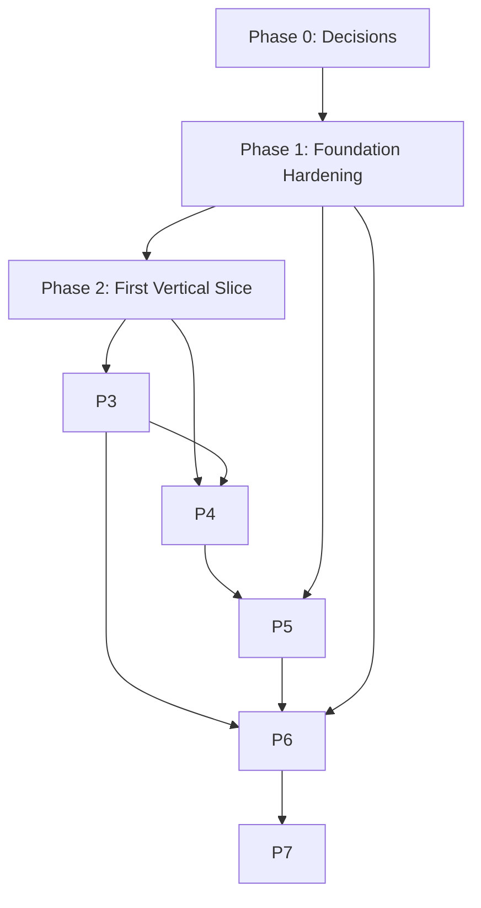

# Implementation Plan — DCIM Core Platform Program

**Tanggal:** 2026-07-28  
**Scope:** Rencana kerja untuk menutup gap antara wiki reference designs dan implementasi aktual, serta mempercepat delivery dengan mengatasi root cause keterlambatan.  
**Prinsip:** Smallest coherent change, evidence-first, gate-driven.

---

## 1. Guiding Principles

1. **Tutup P1 dulu.** Jangan menambah fitur baru sebelum blocker safety, credential, dan keputusan terbuka diselesaikan.
2. **Satu canonical contract.** Gunakan `dcim-core-platform/schemas/*.schema.json` sebagai source of truth untuk semua event topics.
3. **Service code mulai dari core platform.** Setelah CMDB/language diputuskan, implementasi service berada di `dcim-core-platform/services/`, bukan tersebar.
4. **Safety boundary tak boleh dilanggar.** Semua automation write action memerlukan dry-run, approval, blast-radius check, rollback, audit.
5. **CI/CD di semua repo.** Setiap commit harus melewati public-safety scan, lint, dan minimal unit tests.
6. **Hentikan rework loop.** Phase 1 remediation ditutup dengan acceptance matrix yang jelas, bukan dengan perubahan scope berulang.

---

## 2. Phase Overview

| Phase | Nama | Durasi estimasi | Output utama | Gate |
|---|---|---|---|---|
| 0 | Safety & Decision Lock | 3–5 hari | OD-01, OD-07 decided; credential rotation plan; safety policy signed | Owner disposition |
| 1 | Foundation Hardening | 7–10 hari | Issue #20/#21 closed; CI/CD satelit; secret management | `make preflight` PASS |
| 2 | First Vertical Slice | 10–14 hari | P1 server health → dashboard end-to-end; service stubs replaced | Synthetic E2E evidence |
| 3 | Asset + CMDB Services | 14–21 hari | Asset Repository + CMDB API + reconciliation | Contract tests PASS |
| 4 | Analytics Hardening | 14–21 hari | AI API endpoints implemented; LLM/RAG inference | API tests + benchmark |
| 5 | SIEM/SOAR Integration | 14–21 hari | Wazuh → Kafka → SOAR case management | UAC 23 criteria |
| 6 | Workflow Safety Layer | 10–14 hari | Dry-run/approval/blast-radius/audit integrated | Safety negative tests |
| 7 | Multi-Team Staging | 21–30 hari | Integration-RO, demo, staging handover | `STAGING-HANDOVER.md` |

Total rough order: **3–4 bulan** untuk stabil dev-v0.1.0 + first integration-ready milestone, asumsi keputusan owner cepat.

---

## 3. Phase 0 — Safety & Decision Lock (Days 1–5)

### 3.1 Objectives
- ✅ Owner confirmed OD-01 (CMDB) and OD-07 (service language/framework) on 2026-07-28.
- Record confirmed decisions in ADRs, PRD, and architecture docs.
- Tetapkan safety boundary untuk workflow automation.
- Buat rencana rotasi kredensial.
- Freeze Phase 2 scope to minimal P1 server health → dashboard.

### 3.2 Tasks

| ID | Task | Owner | Acceptance Criteria | Status |
|---|---|---|---|---|
| P0-T1 | Record CMDB decision (OD-01 confirmed) | Architect | ADR-0007 updated to Accepted; `services/cmdb/README.md` replaced with scaffold; custom PostgreSQL CMDB service chosen | ✅ Done (ADR-0007 addendum 2026-07-28, service scaffolds committed) |
| P0-T2 | Record service language/framework decision (OD-07 confirmed) | Architect | New ADR created; Python/FastAPI service template in `services/`; TypeScript/React frontend scaffold in `web/` | ✅ Done (ADR-0024 accepted 2026-07-28, scaffolds in `services/`) |
| P0-T3 | Sign safety boundary policy | Owner | `docs/security/automation-safety-boundary.md` approved; n8n restart workflow suspended until hardened | ✅ Done (ADR-0025 + `docs/security/automation-safety-boundary.md` committed) |
| P0-T4 | Credential rotation plan | Security Lead | Inventory of all hardcoded secrets; rotation schedule; Vault/Docker secret migration plan | ✅ Done (doc-only rotation procedure at `docs/security/credential-rotation-procedure.md`; D-6: no values, no endpoints) |
| P0-T5 | Record confirmed PRD decisions | Product Owner | `PRD.md` v1.0 accepted; all Q1–Q10 marked confirmed; `DECISION-LOG-REVIEW.md` and `ARCHITECTURE.md` updated | ✅ Done (research doc sync complete, `PRD.md` v1.0 owner-confirmed 2026-07-28) |
| P0-T6 | Freeze Phase 2 scope | Tech Lead | Issue #21 rewritten with minimal P1 server health → dashboard vertical slice; unstable branch rebased/cleaned | Next actionable (Phase 2 scope-freeze issue, outside Phase 0 gate) |
| P0-T7 | Update wiki reference designs | Wiki Lead | Wiki B5 (React), B1 (ES 9.x / PostgreSQL 16), SIEM-SOAR (TraceCat+Temporal) aligned with confirmed decisions | Next actionable (wiki workstream branch, separate repo) |

### 3.3 Gate

Phase 0 gate is `make phase0-check` — a single entry point running:

- `make compile` — Python syntax/bytecode compilation of `scripts/` and `tests/`.
- `make public-safety` — `scripts/check_public_repo_safety.py` (no credentials, endpoints, forbidden extensions).
- `make validate-json` — JSON schema/fixture validation.
- `make validate-fixtures` — fixture integrity checks.
- `make markdown-links` — all repo-relative Markdown links resolve; cross-repo (wiki) references must be absolute `https://` URLs.
- `make test` — stdlib `unittest` discovery over `tests/`.

Additionally, decision-record invariants in `tests/test_decision_records.py` verify:
- ADR-0007 is Accepted; ADR-0024/0025/0026/0027 exist with Accepted status.
- `OPEN-DECISIONS.md` rows OD-01 and OD-07 contain `ACCEPTED` with ADR links.
- `docs/adr/README.md` crosswalk references every ADR file.

All P0-T1 through P0-T5 are done; P0-T6 and P0-T7 are next actionable outside this repo's Phase 0 gate.

---

## 4. Phase 1 — Foundation Hardening (Days 6–15)

### 4.1 Objectives
- Tutup issue #20 (fresh derived-image findings) dan #21 (Phase 2 slice preparation).
- Bangun CI/CD minimum di setiap repo satelit.
- Mulai rotasi kredensial.
- Susun canonical schema registry contract.

### 4.2 Tasks

#### Core Platform

| ID | Task | Acceptance Criteria |
|---|---|---|
| P1-C1 | Merge PR #22 and close #20 | `make preflight` PASS on `main`; fresh image evidence clean |
| P1-C2 | Stabilize Phase 2 vertical slice branch | Rebase `feat/phase2-first-vertical-slice` onto clean `main`; ≤5 focused commits; backup branches archived/deleted |
| P1-C3 | Update Compose resource limits per ADR-0021 ✅ done 2026-07-28 | `deploy/compose/dev-build/compose.yaml` caps match ADR-0021; `foundation_policy.py` passes |
| P1-C4 | Add demo profile skeleton ✅ skeleton done 2026-07-28 (Docker acceptance pending; C-05 open) | `deploy/compose/demo/compose.yaml` runs synthetic P1 flow; C-05 closed |

#### Data Ingestion

| ID | Task | Acceptance Criteria |
|---|---|---|
| P1-I1 | Add GitHub Actions CI | `.github/workflows/ci.yml` runs public-safety scan, ruff, pytest, schema validation on PR |
| P1-I2 | Migrate secrets to Vault/Docker secrets | Hapus semua hardcoded passwords dari `scripts/*`, `src/*`, `configs/secrets/`; rotasi semua kredensial yang terexpose |
| P1-I3 | Add unit + integration tests | Minimal 30% coverage untuk normalizer, pollers, DLQ; semua test PASS |
| P1-I4 | Create `.avsc` files in Schema Registry | `NormalizedEvent.avsc`, `EnrichedEvent.avsc` committed; compatibility check in CI |
| P1-I5 | Fix version inconsistency | README, version table, docs alignment to v4.7.0 atau v5.0.0 |
| P1-I6 | Align DB and search versions | PostgreSQL upgraded to 17.x across ingestion (16 minimum floor); Elasticsearch aligned to 9.x target |

#### Analytics AI

| ID | Task | Acceptance Criteria |
|---|---|---|
| P1-A1 | Add GitHub Actions CI | CI runs lint, test, public-safety scan |
| P1-A2 | Remove or relocate model weights | `llm/models/` empty because weights not in repo; document artifact storage location |
| P1-A3 | Add smoke tests for implemented services | `anomaly_service`, `rca_engine`, `model_registry` covered by unit tests |

#### Workflow / SIEM / SOAR

| ID | Task | Acceptance Criteria |
|---|---|---|
| P1-W1 | Suspend service-restart workflow | Workflow disabled until hardened |
| P1-W2 | Add safety gate design doc ✅ done 2026-07-28 | `docs/workflow-safety-gates.md` with dry-run/approval/blast-radius/rollback/audit spec |
| P1-S1 | Add CI to SIEM repo | Public-safety scan + Wazuh config syntax check |
| P1-O1 | Add CI to SOAR repo | Public-safety scan + JSON workflow lint |

### 4.3 Gate
- `make preflight` PASS di core.
- Semua satelit repo memiliki CI yang hijau pada `main`.
- Tidak ada kredensial hardcoded di repo publik (verified by `check_public_repo_safety.py`-equivalent).

---

## 5. Phase 2 — First Vertical Slice: P1 Server Health → Dashboard (Days 16–29)

### 5.1 Objectives
- Implementasi end-to-end: Redfish poller → Kafka → normalizer → enricher → PostgreSQL/TimescaleDB → API → Dashboard.
- Ganti service placeholders dengan kode minimal.
- Buktikan tidak ada silent drops dan p95 latency terpenuhi.

### 5.2 Tasks

| ID | Task | Acceptance Criteria |
|---|---|---|
| P2-T1 | Implement Redfish connector service in core | `services/connectors/redfish/` read-only poller with kill switch; contract tests |
| P2-T2 | Implement normalizer service in core | Consumes `dcim.raw.hardware.server`, produces `dcim.normalized.events` Avro |
| P2-T3 | Implement enrichment service in core | Looks up asset/CI context; outputs `dcim.enriched.events` |
| P2-T4 | Implement Asset Repository minimal API | In-memory or PostgreSQL-backed; supports GET by asset_id and alias resolution |
| P2-T5 | Implement CMDB minimal API | CI lookup by hostname/serial; relationship stub |
| P2-T6 | Implement Analytics ingestion bridge | Kafka → TimescaleDB for server metrics |
| P2-T7 | Implement NOC Dashboard minimal view | React view showing P1 server health list; p95 <5s event-to-dashboard |
| P2-T8 | Synthetic E2E test | `fixtures/synthetic/p1-redfish-health.json` flows through pipeline to dashboard |
| P2-T9 | Evidence receipt | `phase2_evidence_receipt.py` records authority/oracle/executor outcome |

### 5.3 Gate
- `make preflight` PASS.
- Synthetic E2E path PASS dengan evidence.
- `ISSUE-9-ACCEPTANCE-MATRIX.md`-style matrix updated for Phase 2.

---

## 6. Phase 3 — Asset Repository + CMDB Services (Days 30–50)

### 6.1 Objectives
- Lengkapi B3 Asset Repository dan B4 CMDB sesuai reference design.
- Reconciliation engine antara discovery, asset, dan CMDB.

### 6.2 Tasks

| ID | Task | Acceptance Criteria |
|---|---|---|
| P3-T1 | Asset Repository PostgreSQL schema | 4 tables; migrations; seed synthetic fixtures |
| P3-T2 | Asset CRUD + bulk import API | 15 UCs mapped; contract tests |
| P3-T3 | CMDB PostgreSQL schema | 11 CI types + 7 relationship types |
| P3-T4 | CMDB CRUD + topology API | Impact analysis query; 16 UCs mapped |
| P3-T5 | Reconciliation engine | Match rules; conflict quarantine; deterministic alias resolution |
| P3-T6 | Redis enrichment cache | <50ms lookup |
| P3-T7 | Audit trail | Every change immutable log |

### 6.3 Gate
- Asset + CMDB contract tests PASS.
- Reconciliation test dengan synthetic conflict scenarios PASS.

---

## 7. Phase 4 — Analytics & AI Hardening (Days 45–65)

### 7.1 Objectives
- Implementasi API endpoints yang masih stub.
- Integrasi LLM/RAG inference pada private host 2×RTX A5000 24 GB VRAM.
- Model registry + training lifecycle.
- Abstraction layer untuk fallback ke managed API jika GPU tidak tersedia.

### 7.2 Tasks

| ID | Task | Acceptance Criteria |
|---|---|---|
| P4-T1 | Implement capacity forecasting API | `/api/v1/analytics/capacity` returns forecast |
| P4-T2 | Implement energy/PUE API | `/api/v1/analytics/energy` returns PUE drift |
| P4-T3 | Implement LLM/RAG inference API | `/api/v1/llm/chat` returns natural language answer; fallback model |
| P4-T4 | Implement RCA history storage | `/api/v1/analytics/rca` stores and retrieves cases |
| P4-T5 | Model training lifecycle | Training orchestrator + registry promotion |
| P4-T6 | Async queue worker | Retry + timeout for inference |
| P4-T7 | RAG v2 implementation | Populate `dcim_ai_v2_rag/rag/` with engine + vector store |
| P4-T8 | Private LLM sizing documentation | Update `(MT-023) Private LLM Platform.md` with 2×RTX A5000 24 GB VRAM sizing; document abstraction layer |

### 7.3 Gate
- All analytics API endpoints respond correctly in integration tests.
- Benchmark results reproducible.

---

## 8. Phase 5 — SIEM/SOC Integration (Days 60–80)

### 8.1 Objectives
- Wazuh ingestion → Kafka → correlation → SOAR case management.
- Threat-intel lists loaded.
- SOC API operational.

### 8.2 Tasks

| ID | Task | Acceptance Criteria |
|---|---|---|
| P5-T1 | Wazuh Kafka producer config | `dcim.siem.events` topic receives Wazuh alerts |
| P5-T2 | Correlation engine | 10+ rules; outputs `dcim.siem.alerts` |
| P5-T3 | Threat-intel CDB lists | 450K lists loaded; update mechanism |
| P5-T4 | SOC API 12 endpoints | Contract tests |
| P5-T5 | Deploy TraceCat + Temporal SOAR stack | TraceCat + Temporal deployed; n8n retained only for non-destructive operational workflows |
| P5-T6 | SOAR case management | Alert → enrichment → case creation flow |
| P5-T7 | UAC evidence | 23 UAC criteria signed off |

### 8.3 Gate
- End-to-end security alert flows to case.
- UAC evidence index complete.

---

## 9. Phase 6 — Workflow Safety Layer (Days 75–90)

### 9.1 Objectives
- Harden workflow automation agar memenuhi safety boundary.
- Dry-run simulator, blast-radius check, approval, rollback, audit.

### 9.2 Tasks

| ID | Task | Acceptance Criteria |
|---|---|---|
| P6-T1 | Safety policy gate microservice | Receives workflow execution request; validates maintenance window + blast-radius |
| P6-T2 | Dry-run simulator | Simulates workflow steps without side effects; returns impact report |
| P6-T3 | Approval service | Multi-level approval with timeout/escalation; immutable decision log |
| P6-T4 | Rollback stubs | Each workflow step exposes rollback action |
| P6-T5 | Audit trail | Every step logged to append-only store |
| P6-T6 | Harden service restart workflow | Only execute after dry-run OK + approval + maintenance window |
| P6-T7 | Harden decommission workflow | Blast-radius check; rollback plan; step-by-step approval |

### 9.3 Gate
- Negative tests: attempt to execute restart without approval → blocked.
- Positive tests: approved restart in maintenance window → executed with full audit.

---

## 10. Phase 7 — Multi-Team Staging & Handover (Days 90–120)

### 10.1 Objectives
- Integration-RO plane activated.
- Demo environment.
- Staging handover contract signed.

### 10.2 Tasks

| ID | Task | Acceptance Criteria |
|---|---|---|
| P7-T1 | Integration-RO compose profile | `deploy/compose/integration-ro/` runnable with pinned read-only identity |
| P7-T2 | Demo environment | `deploy/compose/demo/` with synthetic P1/P2 flow |
| P7-T3 | Runbooks | `docs/runbooks/OPERATIONS.md`, `TROUBLESHOOTING.md` |
| P7-T4 | Staging handover package | `STAGING-HANDOVER.md` signed; tag `dev-v0.1.0` |
| P7-T5 | Training material | Onboarding docs for multi-team |

### 10.3 Gate
- `make preflight` PASS.
- Owner disposition `dev-v0.1.0` accepted.
- All C-0x conditions closed or explicitly deferred.

---

## 11. Dependency Graph

---

## 12. Risk-Adjusted Timeline

| Scenario | Total Duration | Key Assumption |
|---|---|---|
| Optimistic | 2.5 bulan | Owner decisions in 2 days; no new image findings |
| Realistic | 3.5–4 bulan | Decisions in 1 week; 1–2 remediation cycles per phase |
| Pessimistic | 5–6 bulan | Satellite repo access delayed; major security incident requires re-architecture |

---

## 13. Definition of Done per Task

- Kode ada dan lolos CI (lint, test, public-safety scan).
- Jika task mengubah contract, test compatibility PASS.
- Jika task menyentuh automation, safety negative tests PASS.
- Dokumentasi diperbarui (`docs/research/` atau wiki jika diperlukan).
- Evidence artifact committed (untuk phase gates).

---

*Lihat juga: `STATUS-SUMMARY.md`, `GAP-ANALYSIS.md`, `ARCHITECTURE.md`, `PRD.md`, `DELIVERY-VELOCITY-ANALYSIS.md`, `RISK-REGISTER.md`, `DECISION-LOG-REVIEW.md`.*
